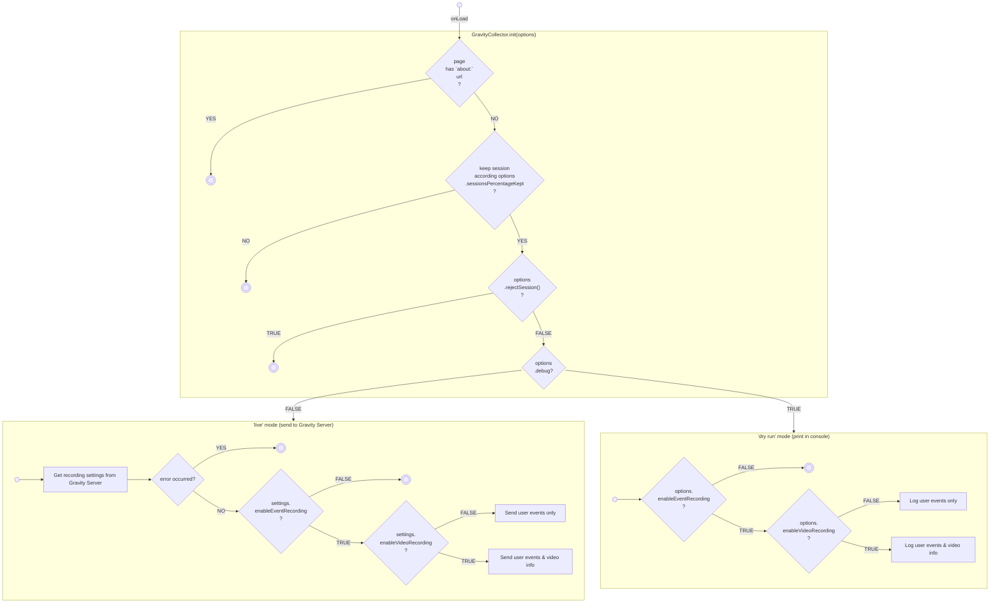

The following flowchart summarizes how Gravity Data Collector decides to listen & send user events.

```mermaid


flowchart TD
    start(( )) -- onLoad --> c1{"page\nhas `about#58;`\nurl\n?"}
    subgraph "GravityCollector.init(options)"
        c1--YES-->end1((( )))
        c1--NO-->c2{"keep session\naccording options\n.sessionsPercentageKept\n?"}
        c2--NO-->end2((( )))
        c2--YES-->c3{"options\n.rejectSession()\n?"}
        c3--TRUE-->end3((( )))
        c3--FALSE-->c4{"options\n.debug?"}
    end
        c4--FALSE-->live
        c4--TRUE-->dryRun

    subgraph dryRun ["'dry run' mode (print in console)"]
        dr_init(( )) --> dr_c1{"options.\nenableEventRecording\n?"}
        dr_c1 --FALSE--> end4((( )))
        dr_c1 --TRUE--> dr_c2{"options.\nenableVideoRecording\n?"}
        dr_c2 --FALSE--> logEvents[Log user events only]
        dr_c2 --TRUE--> logAll[Log user events & video info]
    end

    subgraph live ["'live' mode (send to Gravity Server)"]
        l_init(( )) --> fetchSettings["Get recording settings from Gravity Server"]
        fetchSettings --> l_c1{"error occurred?"}
        l_c1--YES-->end7((( )))
        l_c1--NO-->l_c3{"settings.\nenableEventRecording\n?"}
        l_c3--FALSE-->end6((( )))
        l_c3--TRUE-->l_c4{"settings.\nenableVideoRecording\n?"}
        l_c4--FALSE-->sendEvents[Send user events only]
        l_c4--TRUE-->sendAll[Send user events & video info]
     end
```
